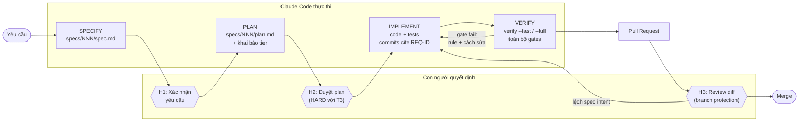
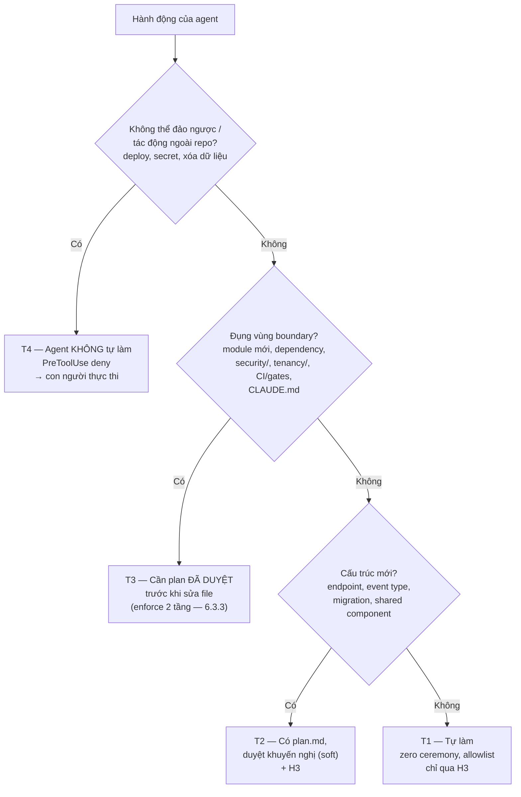
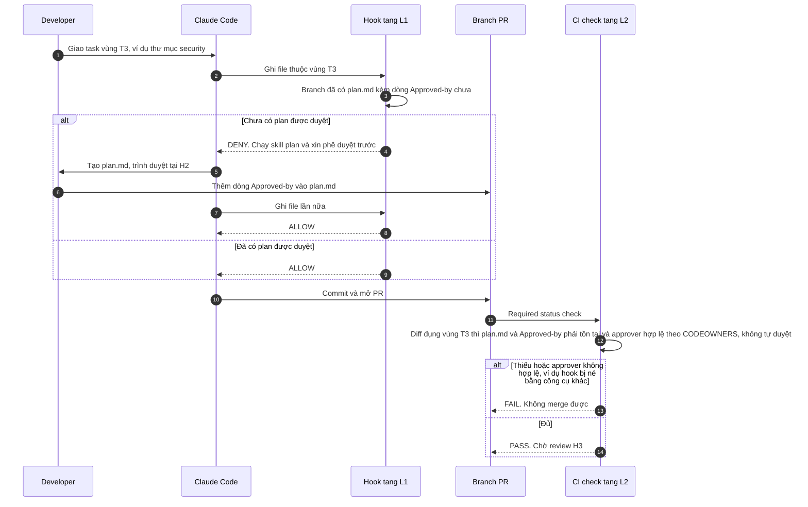
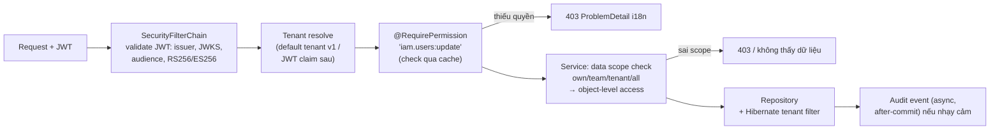
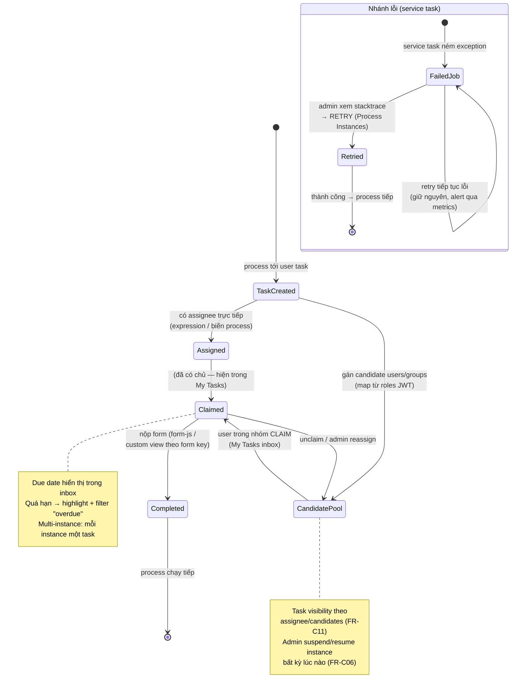
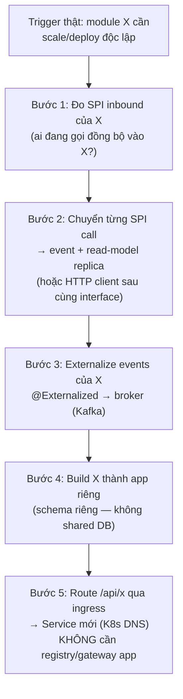

# PRD: cowork-cli — CLI khởi tạo dự án AI-cowork + Human-in-the-loop cho Claude Code

## 0. Thông tin tài liệu

| Trường         | Nội dung                                                                                                                                                                                                                                                                      |
| -------------- | ----------------------------------------------------------------------------------------------------------------------------------------------------------------------------------------------------------------------------------------------------------------------------- |
| Tên PRD        | PRD cowork-cli                                                                                                                                                                                                                                                                |
| Product / Area | cowork-cli (CLI generator) + preset `react-springboot-modulith`                                                                                                                                                                                                               |
| Owner          | Project Owner                                                                                                                                                                                                                                                                 |
| Contributors   | Architecture, Tech Lead, Engineering                                                                                                                                                                                                                                          |
| Stakeholders   | Product Owner, Architecture, Engineering Lead, các team nội bộ sẽ dùng scaffold                                                                                                                                                                                               |
| Status         | Draft                                                                                                                                                                                                                                                                         |
| Version        | v1.0                                                                                                                                                                                                                                                                          |
| Last updated   | 2026-06-11                                                                                                                                                                                                                                                                    |
| Target release | Giai đoạn 1 (preset repo) trước; Giai đoạn 2 (CLI) là mốc phát hành — chưa chốt lịch                                                                                                                                                                                          |
| Links          | Specs: `product/methodology/AI-COWORK.md`, `product/methodology/DESIGN-WORKFLOW.md`, `product/frontend/UIUX-FOUNDATION.md`, `product/cli/CLAUDE-CODE-RUNTIME.md`, `product/cli/PRESET-SPEC.md` · Tham khảo kỹ thuật: `docs/` · Mockup CLI: `.planning/sketches/001-cli-flow/` |

***

## 1. Tóm tắt ngắn gọn

### 1.1 Elevator pitch

Chúng ta xây **cowork-cli** — một CLI sinh dự án full-stack production-grade — cho các team nội bộ áp dụng phương pháp phát triển **AI-cowork + Human-in-the-loop với Claude Code**, để giải quyết vấn đề: dự án mới không có rào chắn chất lượng, không có cấu hình agent, không có quy trình phê duyệt, khiến AI agent sinh code lệch chuẩn và gánh nặng review tăng dần. Một lệnh `npx cowork-cli` cho ra dự án React 19 + Spring Boot 4 Modulith với guardrails tự động, Claude Code được cấu hình đầy đủ, và quy trình Specify → Plan → Implement → Verify có điểm chặn máy-enforce. Thành công đo bằng: build xanh trong 15 phút, developer mới với Claude Code merge PR đầu trong 1 ngày, và **zero** vi phạm kiến trúc lọt vào nhánh chính. Giai đoạn 1 tập trung vào preset repo hoàn chỉnh; CLI và multi-stack là bước sau.

### 1.2 Loại PRD

- [x] Sản phẩm mới
- [ ] Tính năng mới
- [ ] Cải tiến sản phẩm hiện có
- [ ] Release / Migration / Compliance

***

## 2. Bối cảnh và vấn đề

### 2.1 Hiện trạng

Các team bắt đầu dự án mới bằng cách tự ghép: starter template rời rạc + tự cấu hình Claude Code theo kinh nghiệm cá nhân + quy ước kiến trúc truyền miệng. Mức độ tận dụng AI agent phụ thuộc hoàn toàn vào cá nhân; không có chuẩn chung nào được máy enforce.

### 2.2 Vấn đề cần giải quyết

| Vấn đề                                                                                         | Bằng chứng                                                                                               | Mức độ ảnh hưởng |
| ---------------------------------------------------------------------------------------------- | -------------------------------------------------------------------------------------------------------- | ---------------- |
| Agent sinh code lệch chuẩn kiến trúc, không bị phát hiện cho đến review (hoặc không bao giờ)   | Kinh nghiệm dự án nội bộ; ngành ghi nhận AI-generated PR chờ review lâu hơn đáng kể khi thiếu governance | High             |
| Mỗi thành viên cấu hình/prompt agent một kiểu — tri thức kiến trúc không nằm trong repo        | Không repo nào có instruction files chuẩn hóa; onboarding agent lặp lại từ đầu mỗi dự án                 | High             |
| Không rõ việc nào agent tự làm, việc nào cần người duyệt                                       | Hoặc duyệt mọi thứ (tắc nghẽn) hoặc không duyệt gì (rủi ro vùng nhạy cảm: security, tenancy, dependency) | High             |
| Thời gian khởi tạo dự án chuẩn (auth, audit, i18n, a11y, observability, CI) kéo dài nhiều tuần | Ước lượng nội bộ khi tự dựng từ đầu                                                                      | Medium           |

### 2.3 Ai bị ảnh hưởng?

- **Tech Lead:** chịu trách nhiệm chất lượng nhưng thiếu công cụ enforce; review quá tải
- **Developer:** muốn dùng Claude Code hiệu quả nhưng thiếu môi trường được chuẩn bị
- **Tổ chức:** chi phí sửa sai kiến trúc tăng theo cấp số khi phát hiện muộn

### 2.4 Vì sao cần làm bây giờ?

- Phương pháp AI-cowork đang thành mặc định ngành (chuẩn AGENTS.md vào Linux Foundation; spec-driven development phổ biến) — team nào chuẩn hóa sớm hưởng lợi kép
- Claude Code đã đủ năng lực enforce (plan mode, hooks, skills) — điều kiện kỹ thuật chín
- Mỗi dự án mới khởi động không có chuẩn = nợ tích lũy thêm

***

## 3. Mục tiêu và tiêu chí thành công

### 3.1 Business objectives

- Giảm mạnh thời gian từ "quyết định làm dự án" đến "team phát triển tính năng đầu tiên trên nền chuẩn"
- Chuẩn hóa cách mọi team nội bộ làm việc với Claude Code — chất lượng không phụ thuộc cá nhân
- Tạo nền tái sử dụng: một preset đầu tư một lần, nhiều dự án hưởng

### 3.2 Product objectives

- Scaffold tự đứng được: người mới với Claude Code tự onboard bằng tài liệu trong repo
- Kiến trúc được **máy** bảo vệ: vi phạm chặn tại build/CI, không phụ thuộc review mắt người
- Điểm duyệt của con người đặt đúng chỗ: việc nhỏ không vướng thủ tục, vùng rủi ro bắt buộc qua người

### 3.3 Success metrics

| Metric                                                        | Baseline              | Target                                  | Timeframe                             | Owner       |
| ------------------------------------------------------------- | --------------------- | --------------------------------------- | ------------------------------------- | ----------- |
| Thời gian generate → build xanh đầu tiên                      | nhiều tuần (tự dựng)  | < 15 phút                               | Khi Giai đoạn 2 phát hành             | Engineering |
| Developer mới với Claude Code merge PR đầu tiên               | không đo được (tự mò) | ≤ 1 ngày                                | Kiểm chứng trước khi đóng Giai đoạn 1 | PO          |
| Claude Code (zero context) thêm module mới pass toàn bộ gates | n/a                   | ≤ 2 vòng sửa                            | Giai đoạn 1                           | Tech Lead   |
| Hỗ trợ đa nền tảng không WSL                                  | n/a                   | 3/3 OS (Win/macOS/Linux) CI matrix xanh | Giai đoạn 1                           | Engineering |

### 3.4 Guardrail metrics

| Guardrail                                                          | Ngưỡng không được vượt | Lý do                                                           |
| ------------------------------------------------------------------ | ---------------------- | --------------------------------------------------------------- |
| Thay đổi vùng rủi ro cao (T3) vào nhánh chính không qua duyệt plan | 0                      | Đây là lời hứa lõi của methodology — vỡ là vỡ niềm tin sản phẩm |
| Vi phạm pattern kiến trúc thuộc phạm vi gates (gate-covered) lọt vào nhánh chính | 0     | Guardrails là deterministic; >0 nghĩa là gate có lỗ             |
| `verify --fast` (vòng lặp nhanh của agent)                         | < 60 giây              | Vòng feedback chậm phá hiệu suất agent và dev                   |

Ngoại lệ gate chỉ được phép qua **waiver register**: ghi nhận tường minh trong repo, có thời hạn (time-boxed), được Architect/Tech Lead phê duyệt, và theo dõi đến khi gỡ bỏ. Cấm tắt gate ad-hoc khi gate "gây phiền" — gate có vấn đề thì sửa gate qua quy trình, không bypass.

***

## 4. Người dùng mục tiêu và use cases

### 4.1 Persona / Segment

| Persona       | Mô tả                                                        | Nhu cầu                                                             | Pain point                                   | Tần suất sử dụng                           |
| ------------- | ------------------------------------------------------------ | ------------------------------------------------------------------- | -------------------------------------------- | ------------------------------------------ |
| Tech Lead     | Vững kiến trúc; có thể mới với Claude Code                   | Bootstrap dự án 1 buổi; mọi thành viên sinh code cùng chuẩn         | Review quá tải; chuẩn chỉ tồn tại trong đầu  | Khởi tạo: 1 lần/dự án; vận hành: hằng ngày |
| Developer     | Biết lập trình; **chưa quen Claude Code / agentic workflow** | Hiệu quả với Claude Code từ ngày đầu, không cần đào tạo riêng       | Không biết bắt đầu từ đâu; sợ agent phá code | Hằng ngày                                  |
| PM / Designer | Không cần biết công cụ dev                                   | Mô tả UI bằng Google Stitch; nhận implementation đúng design system | Handoff design–dev thủ công, sai lệch        | Theo nhịp design                           |

### 4.2 Use cases

| Use case ID | Tên use case                                          | Actor                         | Mục tiêu                                                        | Priority             |
| ----------- | ----------------------------------------------------- | ----------------------------- | --------------------------------------------------------------- | -------------------- |
| UC-01       | Khởi tạo dự án mới qua CLI                            | Tech Lead                     | Có dự án chạy được + đủ guardrails/agent config trong < 15 phút | Must                 |
| UC-02       | Khởi tạo từ preset repo (không cần CLI — Giai đoạn 1) | Tech Lead                     | Clone + init script → dự án dùng được                           | Must                 |
| UC-03       | Developer mới onboard với Claude Code                 | Developer                     | Merge PR đầu tiên trong ≤ 1 ngày chỉ với tài liệu trong repo    | Must                 |
| UC-04       | Phát triển tính năng qua S→P→I→V cùng agent           | Developer                     | Tính năng vào main đúng chuẩn, đúng điểm duyệt                  | Must                 |
| UC-05       | Thêm module backend mới                               | Developer + agent             | Module đúng DAG, pass verify, không sửa tay boilerplate         | Must                 |
| UC-06       | Quản trị user/role/permission                         | Admin (app được sinh)         | Quản lý IAM đầy đủ, an toàn, có audit                           | Must                 |
| UC-07       | Thiết kế UI bằng Stitch → agent implement             | PM/Designer + Developer       | UI đúng design tokens, đạt a11y                                 | Should               |
| UC-08       | Vận hành quy trình nghiệp vụ (BPM bật)                | Business user (app được sinh) | Thiết kế process, xử lý task inbox, theo dõi instance           | Should               |
| UC-09       | Tách module thành service riêng                       | Tech Lead                     | Theo playbook, không phá kiến trúc                              | Could (theo trigger) |

### 4.3 User journey / Flow

**Journey A — Giai đoạn 1, dùng preset repo trực tiếp:**

1. Tech Lead clone repo, chạy `scripts/init` (đổi placeholder `com.acme.app` → tên team, tự commit)
2. `task up` → hạ tầng local (PostgreSQL, Redis, Mailpit, MinIO, Keycloak, observability) chạy bằng một lệnh
3. `./mvnw verify` + `npm run build` xanh → cấu hình branch protection theo hướng dẫn
4. Developer đọc `ONBOARDING.md` → mở Claude Code → phiên đầu được `CLAUDE.md` dẫn → làm theo tutorial `specs/000-example/`
5. Task thật đầu tiên: skill `plan` → người duyệt (H2 nếu T3) → implement → skill `verify` → PR → review (H3) → merge

**Journey B — Giai đoạn 2, qua CLI** (mockup: `.planning/sketches/001-cli-flow/`):

1. `npx cowork-cli` → nhập tên dự án, groupId, artifactId (packageRoot **tự suy ra**, không hỏi)
2. Chọn preset (`react-springboot-modulith`) → tùy chọn: mức nghiêm ngặt duyệt plan (standard/strict), design workflow (bật/tắt), BPM (bật/tắt)
3. CLI render template → emit Claude Code pack → `git init` + commit đầu → hỏi cài dependency → hỏi chạy sanity build
4. Màn hình "Next steps" → tiếp tục như Journey A bước 4

***

## 5. Phạm vi

### 5.1 In scope

- Preset `react-springboot-modulith` hoàn chỉnh build xanh 3 OS (backend 12 modules + frontend + hạ tầng local/K8s)
- Hệ Security & IAM đầy đủ (AuthN, AuthZ permission+scope, User Management, Audit) — chi tiết §6
- BPM nhúng dạng tùy chọn khi generate (Flowable 8 + UI tự phát triển) — chi tiết §6; option-gated — chỉ thuộc DoD của release có bật option (§6 nhóm C, §12.2); BPM tắt là đường nghiệm thu bắt buộc duy nhất của Giai đoạn 1/2
- Bộ guardrails CI-blocking (12+ gates) chạy được local
- Claude Code pack: CLAUDE.md ba tầng, 5 skills, hooks enforce, allowlist, MCP
- Methodology pack: S→P→I→V, tiers T1–T4, checkpoints H1–H3, `specs/`, ONBOARDING + tutorial
- Harness quality: error legibility, resume convention, verify phân tầng
- CLI mỏng: prompt flow + render + emit + post-gen
- Config nguồn chuyển đổi (ConfigMap mặc định / Consul KV tùy chọn); playbook tách service

### 5.2 Out of scope

- Tính năng AI bên trong app được sinh ra (chatbot, gọi LLM API) — sản phẩm dùng AI để **xây** phần mềm, không nhúng AI **vào** phần mềm
- Hỗ trợ AI runtime khác (Cursor, Codex, Copilot, Gemini) — dành riêng Claude Code; đa runtime làm loãng giá trị enforce
- GUI/web wizard cho CLI; host/proxy LLM
- GraphQL, SSR/Next.js, message broker trong v1, H2, Redux/MUI — anti-stack đã khóa theo đặc tả preset (`docs/`)

### 5.3 MVP vs Future

| Hạng mục                                                          | MVP                          | Future (trigger)                    |
| ----------------------------------------------------------------- | ---------------------------- | ----------------------------------- |
| Preset react-springboot-modulith + methodology + Claude Code pack | Có                           | —                                   |
| CLI generate                                                      | Có (Giai đoạn 2)             | —                                   |
| BPM bậc 1 (engine, tasks, inbox, viewer, admin)                   | Có (khi bật option)          | —                                   |
| BPM bậc 2–3 (full modeler, form builder, DMN editor)              | Không                        | Theo bậc, trong phạm vi option      |
| Multi-tenant vận hành đầy đủ                                      | Không (tenancy-ready)        | Có khách multi-tenant               |
| MFA TOTP, invite user                                             | Có (nâng cao, sau lõi AuthN) | —                                   |
| Passkey/WebAuthn, SSO/OIDC ngoài                                  | Không                        | Yêu cầu enterprise                  |
| Preset thứ hai + engine tổ hợp                                    | Không                        | Yêu cầu preset 2                    |
| `cowork update` (re-apply template)                               | Không                        | Preset đổi lớn khi ≥2 dự án đã sinh |
| Tách service + Spring Cloud Gateway                               | Không (có playbook)          | Module cần scale độc lập thật       |
| Hot-reload config                                                 | Không (đổi qua rollout)      | Yêu cầu vận hành cụ thể             |
| OSS / binary distribution                                         | Không (npx nội bộ)           | Proven nội bộ                       |

***

## 6. Yêu cầu chức năng

### 6.1 Feature list

**Nhóm A — Application preset (**`react-springboot-modulith`**)**

**Release:** Giai đoạn 1 — toàn bộ FR nhóm A thuộc DoD Giai đoạn 1.

| ID     | Feature / Requirement        | Mô tả                                                                                                                                                                                                                                      | Priority | Notes                     |
| ------ | ---------------------------- | ------------------------------------------------------------------------------------------------------------------------------------------------------------------------------------------------------------------------------------------ | -------- | ------------------------- |
| FR-A01 | Modulith 12 modules          | `shared, appconfig, i18n, caching, observability, security, tenancy, audit, email, storage, jobs, usermgmt`; mỗi module khai báo allowed dependencies; ghi cross-module qua events, đọc qua SPI; **dependency graph kiểm chứng tại build**; 12 modules là cơ sở — bật option BPM thêm module 13 `bpm`; module-count trong gates/skills/ModularityTests phải dynamic theo option | Must     | Vi phạm = build fail      |
| FR-A02 | Boot stack một lệnh          | `task up`: PostgreSQL 16, Redis, Mailpit, MinIO, Keycloak, observability stack — Win/macOS/Linux không WSL                                                                                                                                 | Must     | Named volumes             |
| FR-A03 | Event reliability            | Event Publication Registry (JDBC): republish khi restart, retry có bound, dọn bản ghi cũ; kill-listener test chứng minh không mất event                                                                                                    | Must     |                           |
| FR-A04 | Tenancy-ready, single-tenant | Cột `tenant_id` mọi bảng nghiệp vụ, Hibernate filter, TenantContext, cache key theo tenant; v1 resolve 1 default tenant từ config; test cách ly 2 tenant ở DB level chứng minh seam đúng                                                   | Must     | Multi-tenant ops = Future |
| FR-A05 | Persistence chuẩn            | PostgreSQL 16 duy nhất (không H2); Flyway migrations per-module; Testcontainers cho integration test; entity không cross controller boundary (record DTO + MapStruct)                                                                      | Must     |                           |
| FR-A06 | API chuẩn                    | RFC 9457 ProblemDetail (i18n message + traceId), Bean Validation tại boundary, OpenAPI 3.1 → Orval sinh TS client + TanStack Query hooks; CI chặn drift contract                                                                           | Must     |                           |
| FR-A07 | Observability                | Liveness/readiness probes; structured JSON logs với MDC allowlist (chặn PII); OTel traces browser→repository; metrics Prometheus; Web Vitals                                                                                               | Must     |                           |
| FR-A08 | Frontend foundation          | React 19 + Vite + TS strict; shadcn/ui + Tailwind 4; TanStack Query (server state) + Zustand (UI state, cấm token); RHF + Zod; i18n vi/en; chi tiết UX: `UIUX-FOUNDATION.md`                                                               | Must     |                           |
| FR-A09 | K8s manifests                | Kustomize base/overlays, HPA, PDB, NetworkPolicy, probes, external secrets; image: Buildpacks (BE) + multi-stage Nginx (FE)                                                                                                                | Must     |                           |
| FR-A10 | Config nguồn chuyển đổi      | Modules chỉ đọc typed properties; nguồn chọn theo profile: env+ConfigMap/Secret (mặc định) hoặc Consul KV (`spring.config.import`, VM/hybrid); config đọc lúc boot, đổi qua rollout                                                        | Must     | Hot-reload = Future       |
| FR-A11 | Topology + extraction        | Một deployable; `EXTRACTION.md` playbook ship kèm: nhận diện SPI inbound → chuyển event/read-model → externalize events (`@Externalized`) → route ingress; K8s DNS + ingress/Gateway API — không registry/gateway app                      | Must     |                           |
| FR-A12 | Init script                  | `scripts/init.(sh\|ps1)` đổi `com.acme.app` → giá trị team, tự commit                                                                                                                                                                      | Must     | Giai đoạn 1 entry point   |

**Nhóm B — Security & IAM** (đặc tả đầy đủ: `docs/security_authz_user_management_design.md`)

**Release:** Giai đoạn 1 — toàn bộ FR nhóm B thuộc DoD Giai đoạn 1 (FR-B07/B08 mức Should — nâng cao, sau lõi AuthN theo §5.3).

| ID     | Feature / Requirement     | Mô tả                                                                                                                                                                                                                                                                                       | Priority | Notes                  |
| ------ | ------------------------- | ------------------------------------------------------------------------------------------------------------------------------------------------------------------------------------------------------------------------------------------------------------------------------------------- | -------- | ---------------------- |
| FR-B01 | Đăng nhập / đăng xuất     | Email-password; lỗi trả thông báo chung + timing đồng nhất (chống enumeration); rate limit + account lock/throttling hiển thị cooldown                                                                                                                                                      | Must     |                        |
| FR-B02 | Token & phiên             | Access token ngắn hạn in-memory; refresh token HttpOnly+Secure+SameSite cookie, **rotation** mỗi lần refresh (cấp mới + vô hiệu cũ); revocation blacklist theo `jti` (Caffeine dev/Redis prod)                                                                                              | Must     | Cấm localStorage       |
| FR-B03 | Xác minh email            | Token có hạn 24–72h; policy chặn đăng nhập khi chưa verify (cấu hình được)                                                                                                                                                                                                                  | Must     |                        |
| FR-B04 | Quên/đặt lại/đổi mật khẩu | Reset token one-time + hash + hạn 15–60'; phản hồi trung tính; reset xong **revoke toàn bộ phiên**; đổi mật khẩu yêu cầu mật khẩu hiện tại                                                                                                                                                  | Must     |                        |
| FR-B05 | Chính sách mật khẩu       | Hash Argon2id/bcrypt có cost phù hợp; độ dài tối thiểu 8–12, tối đa ≥64; blocklist mật khẩu phổ biến/lộ; không ép complexity và đổi định kỳ; cho phép paste/autofill                                                                                                                        | Must     | Theo NIST 800-63B      |
| FR-B06 | Quản lý phiên & thiết bị  | Màn hình danh sách phiên (browser/OS/IP/last-active, badge "current"); revoke từng phiên / tất cả phiên khác                                                                                                                                                                                | Must     |                        |
| FR-B07 | Mời user                  | Admin nhập email+role → user trạng thái Invited → email link có hạn 3–7 ngày → đặt mật khẩu → Active; màn accept hiển thị người mời + tổ chức                                                                                                                                               | Should   |                        |
| FR-B08 | MFA TOTP + backup codes   | Enroll: QR + manual key → **verify 1 mã trước khi kích hoạt** → backup codes bắt xác nhận đã lưu; verify khi login; admin reset MFA (bắt buộc audit + step-up)                                                                                                                              | Should   |                        |
| FR-B09 | Permission model          | `<module>.<resource>:<action>` (vd `iam.users:read`, `iam.users:assign-role`); action chuẩn hóa (read/create/update/delete/approve/export/assign/execute...); cấm hard-code role trong business logic                                                                                       | Must     |                        |
| FR-B10 | Data scope                | Mỗi grant kèm scope `own/team/department/tenant/all`; service layer kiểm tra object-level access theo scope; test 403 cho sai scope                                                                                                                                                         | Must     |                        |
| FR-B11 | Permission catalog        | Danh mục hệ thống: code, tên, module, action, risk level (Low→Critical), trạng thái (Active/Deprecated); script sync code ↔ DB; quyền bỏ đi đánh dấu deprecated trước khi xóa                                                                                                               | Must     | Cơ chế sync (Flyway migration vs startup task) + quy tắc dọn quyền deprecated → chốt bằng ADR trước khi implement |
| FR-B12 | Roles                     | Role = tập permission+scope; seed mặc định: Super Admin, Tenant Admin, User Manager, Auditor, Member; role hệ thống khóa không sửa                                                                                                                                                          | Must     |                        |
| FR-B13 | Enforce & cache           | Constants + annotation `@RequirePermission`; permission cache theo user/role; invalidation: gán/gỡ role, sửa quyền role → clear cache; disable user → clear + revoke session; **API protected thiếu khai báo permission = fail CI**                                                         | Must     | Gate riêng; cơ chế CI detect API thiếu khai báo (quét OpenAPI / ArchUnit-style reflection test) → chốt bằng ADR |
| FR-B14 | Authority seam            | Nạp quyền qua seam mở: claim-based (JWT) trước, permission-store sau — nâng cấp không sửa SecurityFilterChain/`@PreAuthorize`                                                                                                                                                               | Must     |                        |
| FR-B15 | Multi-IdP                 | Spring Authorization Server (tự host) hoặc Keycloak 26 — profile switch, một codebase, một filter chain; JWKS rotation không cần restart; pin RS256/ES256                                                                                                                                   | Must     |                        |
| FR-B16 | User CRUD + lifecycle     | Danh sách (search/filter: status, role, last-login; phân trang; bulk actions), chi tiết theo tab; vòng đời: Invited → Pending Verification → Active → Password-Reset-Required → MFA-Required → Locked → Suspended → Deactivated → Deleted/Anonymized, kèm quy tắc đăng nhập từng trạng thái | Must     |                        |
| FR-B17 | Thao tác admin nhạy cảm   | Gán role admin, reset password/MFA, revoke sessions, xóa user: xác nhận (type-to-confirm với xóa) + step-up auth + audit bắt buộc                                                                                                                                                           | Must     |                        |
| FR-B18 | Ma trận quyền UI          | Grid role×permission: nhóm theo module (collapsible), sticky header, search, filter "only granted", highlight quyền rủi ro cao, **xem trước thay đổi trước khi lưu**; trình xem **quyền hiệu lực** của user kèm nguồn gốc ("có quyền X qua role Y")                                         | Must     |                        |
| FR-B19 | Audit log                 | Ghi sự kiện: auth (login ok/fail, logout, reset), MFA, user mgmt, đổi quyền, phiên, security (lock, suspicious, denied); bản ghi: actor, action, resource, before/after, IP, user agent, tenant; UI timeline có filter + drawer xem diff + export                                           | Must     | Qua event sink `audit` |

**Nhóm C — BPM (tùy chọn khi generate; bật → module 13** `bpm`**)**

**Release:** Option-gated — chỉ là Must khi option BPM bật lúc generate; không thuộc DoD Giai đoạn 1/2 khi BPM tắt. Cam kết bậc 1 chặn bởi spike Q-006 (§14).

| ID     | Feature / Requirement | Mô tả                                                                                                                                                                                                                      | Priority       | Notes                      |
| ------ | --------------------- | -------------------------------------------------------------------------------------------------------------------------------------------------------------------------------------------------------------------------- | -------------- | -------------------------- |
| FR-C01 | Engine nhúng          | Flowable 8 (Apache 2.0, dòng tương thích Spring Boot 4) in-process; bảng engine cùng PostgreSQL, schema quản qua Flyway (tắt auto-update engine); chung transaction manager với JPA — process + nghiệp vụ commit nguyên tử | Must (bậc 1)   |                            |
| FR-C02 | Identity tái dùng     | Không dùng Flowable IDM: candidate groups là chuỗi map từ roles trong JWT; REST API engine đi qua SecurityFilterChain của app                                                                                              | Must (bậc 1)   | Một nguồn sự thật identity |
| FR-C03 | Module boundary       | Service task gọi nghiệp vụ module khác qua SPI; sự kiện process bridge sang event registry; tuân thủ DAG như mọi module                                                                                                    | Must (bậc 1)   |                            |
| FR-C04 | Tenant-aware          | Deployment + process instance gắn tenant id (Flowable hỗ trợ first-class)                                                                                                                                                  | Must (bậc 1)   |                            |
| FR-C05 | Tasks & inbox         | Start Process; My Tasks inbox: claim/complete, due date, multi-instance; assignment theo assignee/candidate users+groups                                                                                                   | Must (bậc 1)   |                            |
| FR-C06 | Process admin         | Instances: suspend/resume/delete, xem & sửa variables, reassign task; failed jobs + stacktrace + retry; lịch sử đầy đủ; diagram viewer tô sáng đường đã chạy                                                               | Must (bậc 1)   |                            |
| FR-C07 | Deploy definitions    | Import/export `.bpmn`; auto-deploy từ resources; mỗi deploy tạo version mới                                                                                                                                                | Must (bậc 1)   |                            |
| FR-C08 | BPMN modeler in-app   | bpmn-js: vẽ/sửa + properties panel cho thuộc tính Flowable (**tự phát triển** — không có sẵn package đạt chất lượng) gồm bean picker chọn service task từ catalog SPI; deploy từ UI                                        | Should (bậc 2) | Khối effort lớn nhất       |
| FR-C09 | Form builder          | form-js kéo-thả (điều kiện hiển thị, validation); schema JSON lưu/version cùng process definition; hoặc custom React view theo form key; không dùng form engine Flowable                                                   | Should (bậc 2) |                            |
| FR-C10 | DMN decision tables   | dmn-js editor in-app, đủ hit policies; gắn qua Business Rule Task                                                                                                                                                          | Could (bậc 3)  |                            |
| FR-C11 | Phân quyền BPM        | Hai vai trò: BPM administrator (admin views) / process actor (tham gia); task visibility theo assignee/candidates                                                                                                          | Must (bậc 1)   |                            |

**Nhóm D — Guardrails (tất cả CI-blocking + chạy local)**

**Release:** Giai đoạn 1 — toàn bộ gates thuộc DoD Giai đoạn 1.

| ID     | Feature / Requirement        | Mô tả                                                                                                               | Priority |
| ------ | ---------------------------- | ------------------------------------------------------------------------------------------------------------------- | -------- |
| FR-D01 | Modulith verify              | Dependency graph acyclic, đúng khai báo (12 modules cơ sở; 13 khi bật option BPM)                                   | Must     |
| FR-D02 | ArchUnit rules               | Cấm field injection, bare `@Scheduled`, native query ngoài wrapper, `@Transactional` private, entity cross boundary | Must     |
| FR-D03 | Frontend zones               | ESLint chặn import sai hướng (`shared → features → app`), cấm cross-feature                                         | Must     |
| FR-D04 | Design-token lint            | Cấm raw hex/px trong JSX/CSS; kiểm drift tokens ↔ Tailwind                                                          | Must     |
| FR-D05 | A11y gate                    | axe-core trên build — WCAG 2.2 AA                                                                                   | Must     |
| FR-D06 | i18n parity                  | Mọi key có đủ vi + en                                                                                               | Must     |
| FR-D07 | Contract drift               | Backend OpenAPI → regen client → tsc phải xanh                                                                      | Must     |
| FR-D08 | Secret scan                  | Bundle + Docker layers; CVE scan images                                                                             | Must     |
| FR-D09 | Tenancy isolation test       | Cross-tenant read bị chặn (seed 2 tenant)                                                                           | Must     |
| FR-D10 | Plan-compliance check        | Diff đụng T3 paths → `specs/NNN-*/plan.md` phải có dòng `Approved-by:`; CI xác thực danh tính người duyệt — approver phải thuộc danh sách hợp lệ (CODEOWNERS của các T3 paths bị đụng, hoặc danh sách approver khai báo tường minh); cấm tự duyệt: approver ≠ tác giả plan và ≠ committer; thiếu hoặc approver không hợp lệ = không merge; cơ chế xác thực approver phải dựa trên Git hosting API / PR review metadata (không chỉ dòng text trong plan.md), và phải chịu được squash merge, rebase, bot commits, dòng Approved-by bị copy — cơ chế cụ thể xác nhận trong Q-002 | Must     |
| FR-D11 | Permission-declaration check | API protected thiếu khai báo quyền = fail                                                                           | Must     |
| FR-D12 | CLAUDE.md checks             | Size budget; smoke các lệnh nêu trong CLAUDE.md chạy được                                                           | Must     |

**Nhóm E — Claude Code pack & Methodology**

**Release:** Giai đoạn 1 — FR-E01..E08 thuộc DoD Giai đoạn 1; FR-E09 (design workflow) là option-gated, chỉ là Must khi option bật.

| ID     | Feature / Requirement      | Mô tả                                                                                                                                                                                                                                                                  | Priority |
| ------ | -------------------------- | ---------------------------------------------------------------------------------------------------------------------------------------------------------------------------------------------------------------------------------------------------------------------- | -------- |
| FR-E01 | CLAUDE.md ba tầng          | Root ≤200 dòng (tổng quan, lệnh, con trỏ, bảng tier rút gọn, anti-stack) + `backend/` + `frontend/` ≤150 dòng (quy tắc cục bộ, lazy-load theo cây làm việc); không trùng lặp giữa tầng                                                                                 | Must     |
| FR-E02 | Skills ×5                  | `new-module` (scaffold module đúng DAG + bump count + plan template), `new-feature` (feature folder đúng zone + i18n keys), `design-implement` (Stitch MCP → shadcn + tokens), `plan` (emit plan.md đúng format + tier), `verify` (chạy gates, tóm tắt fail theo rule) | Must     |
| FR-E03 | Hooks enforce              | PreToolUse deny Write/Edit trên T3 paths khi branch thiếu plan có `Approved-by:` (kèm message giải thích + bước tiếp); deny T4 command patterns (deploy/secret/destructive); strictness `strict` mở rộng gate xuống T2                                                 | Must     |
| FR-E04 | Allowlist T1               | Lệnh thường nhật (`task *`, `./mvnw verify`, `npm run *`) pre-approved — zero ceremony                                                                                                                                                                                 | Must     |
| FR-E05 | Workflow S→P→I→V           | Checkpoints H1 (xác nhận yêu cầu), H2 (duyệt plan — HARD cho T3 bằng 2 tầng hook+CI), H3 (review diff — branch protection, CODEOWNERS cho security/tenancy); tiers T1 thường nhật → T4 không đảo ngược                                                                 | Must     |
| FR-E06 | Spec artifacts             | `specs/NNN-feature/{spec,plan,tasks}.md`; branch đặt tên theo spec; commit cite REQ-ID; quy tắc reconcile spec khi behavior lệch                                                                                                                                       | Must     |
| FR-E07 | Onboarding                 | `ONBOARDING.md` (ngày đầu: cài đặt, phiên đầu, task đầu) + `specs/000-example/` đi trọn S→P→I→V trong lịch sử commit, chú thích từng artifact "tại sao" — dùng như tutorial                                                                                            | Must     |
| FR-E08 | Harness quality            | Lỗi gate nêu rule + cách sửa (agent self-correct ≤2 vòng); resume convention (đọc spec → plan → progress → git log); `verify --fast` <60s tách `verify --full`                                                                                                         | Must     |
| FR-E09 | Design workflow (tùy chọn) | DESIGN.md + tokens.json + Stitch lint + `.mcp.json` Stitch MCP; degrade được khi không dùng Stitch                                                                                                                                                                     | Should   |

**Nhóm F — CLI (Giai đoạn 2)**

**Release:** Giai đoạn 2 — toàn bộ FR nhóm F là mốc phát hành Giai đoạn 2.

| ID     | Feature / Requirement | Mô tả                                                                                        | Priority |
| ------ | --------------------- | -------------------------------------------------------------------------------------------- | -------- |
| FR-F01 | Interactive + flags   | Prompt flow (identity → preset → options) và non-interactive flags đầy đủ cho CI/agent       | Must     |
| FR-F02 | Computed identity     | packageRoot suy từ groupId+artifactId — không hỏi thừa                                       | Must     |
| FR-F03 | Render an toàn        | Token replacement; binary copy nguyên trạng; quét `{{` sót = fail; không symlink; idempotent | Must     |
| FR-F04 | Emit Claude Code pack | CLAUDE.md ×3, skills, hooks theo strictness, .mcp.json theo option                           | Must     |
| FR-F05 | Post-gen              | git init + commit đầu → hỏi install → hỏi sanity build → in next steps                       | Must     |
| FR-F06 | Preset validity CI    | Generation matrix 3 OS: generate → build xanh → assert đủ artifacts                          | Must     |

### 6.2 User stories (đại diện — acceptance chi tiết theo FR)

#### Story: Tech Lead khởi tạo dự án

**As a** Tech Lead, **I want to** chạy một lệnh sinh dự án đầy đủ chuẩn, **so that** team bắt đầu viết tính năng ngay thay vì dựng nền nhiều tuần.

**Acceptance criteria**

- Given máy đạt yêu cầu (Node 22, Java 21, Docker), when chạy `npx cowork-cli` và trả lời prompts, then dự án được sinh, `git log` có commit đầu, và `task up` + `./mvnw verify` + `npm run build` xanh trong < 15 phút.
- Given chọn BPM = off, when generate, then không có module `bpm`, không dependency Flowable trong cây.

**Business rules:** packageRoot luôn được suy ra; mọi tùy chọn có default hợp lý.\
**Edge cases:** thiếu Docker → cảnh báo rõ trước khi generate; thư mục đích không rỗng → từ chối.

#### Story: Developer mới merge PR đầu tiên

**As a** developer chưa từng dùng Claude Code, **I want to** được repo dẫn dắt từng bước, **so that** tôi merge được PR đầu trong một ngày.

**Acceptance criteria**

- Given chỉ đọc ONBOARDING.md + specs/000-example/, when thực hiện task được giao theo quy trình, then PR pass toàn bộ gates và merge trong ≤ 1 ngày làm việc.
- Given tôi sửa file thuộc vùng T3 mà chưa có plan duyệt, when agent ghi file, then hook chặn với thông báo nêu lý do và chỉ rõ "chạy skill `plan` trước".

#### Story: Admin gán role

**As an** admin, **I want to** gán role cho user và thấy quyền hiệu lực, **so that** tôi kiểm soát truy cập chính xác.

**Acceptance criteria**

- Given tôi có `iam.users:assign-role`, when gán role, then hệ ghi audit (actor, before/after) và cache quyền của user đó được làm mới ngay.
- Given tôi mở trình xem quyền hiệu lực, when chọn user, then thấy từng quyền kèm nguồn gốc role và scope.
- Given tôi thiếu quyền, when gọi API gán role trực tiếp, then nhận 403 và UI không hiển thị action này.

#### Story: Nhân viên xử lý phê duyệt (BPM bật)

**As a** nhân viên, **I want to** thấy việc chờ tôi trong My Tasks và hoàn thành bằng form, **so that** quy trình chạy không cần hỏi qua chat.

**Acceptance criteria**

- Given process tạo user task gán candidate group trùng role tôi có, when mở My Tasks, then thấy task, claim được, form render đúng định nghĩa, complete xong process chạy tiếp.
- Given service task lỗi, when admin mở failed jobs, then thấy stacktrace và retry được.

### 6.3 Sơ đồ luồng chính

#### 6.3.1 Quy trình làm việc Specify → Plan → Implement → Verify (FR-E05)

#### 6.3.2 Phân loại mức rủi ro hành động (T1–T4)

#### 6.3.3 Enforce duyệt plan vùng T3 — hai tầng (FR-E03 + FR-D10)

Tầng L1 (hook) chặn ngay trong phiên — trải nghiệm tốt, tiết kiệm công; tầng L2 (CI) là **sàn không thể né** kể cả khi không dùng Claude Code. Tầng L2 đồng thời xác thực danh tính người duyệt: approver phải thuộc CODEOWNERS theo các T3 paths bị đụng (hoặc danh sách approver khai báo tường minh) và **cấm tự duyệt** — approver không được là tác giả plan hay committer. Cơ chế xác thực approver phải dựa trên Git hosting API / PR review metadata (không chỉ dòng text trong plan.md), và phải chịu được squash merge, rebase, bot commits, dòng Approved-by bị copy; cơ chế cụ thể xác nhận trong Q-002.

#### 6.3.4 Luồng kiểm tra quyền mỗi request (FR-B09..B14)

#### 6.3.5 BPM task lifecycle (FR-C05, FR-C06)

#### 6.3.6 Đường tách module thành service (EXTRACTION.md — FR-A11)

***

## 7. Yêu cầu phi chức năng

| Nhóm            | Yêu cầu                                                              | Tiêu chí đo / nghiệm thu                                                                   | Owner           |
| --------------- | -------------------------------------------------------------------- | ------------------------------------------------------------------------------------------ | --------------- |
| Performance     | Vòng lặp feedback của agent/dev nhanh                                | `verify --fast` < 60s; generate → build xanh < 15'                                         | Engineering     |
| Performance     | App được sinh đạt baseline                                           | P95 read < 300ms, write < 800ms; LCP < 2.5s, INP < 200ms (theo đặc tả preset)              | Engineering     |
| Security        | Backend-authoritative; deny by default; secrets không vào git/bundle | Checklist security trong design doc pass; secret-scan gate xanh; pen-test checklist nội bộ | Security        |
| Privacy         | Log không chứa PII; audit giữ dữ liệu đúng chính sách                | MDC allowlist filter; trường audit được duyệt; retention cấu hình được                     | Security/Legal  |
| Accessibility   | WCAG 2.2 AA toàn bộ UI shipped                                       | axe-core CI gate xanh; checklist keyboard + screen-reader trong PR template                | Design/Frontend |
| Reliability     | Không mất event; jobs không chạy trùng                               | Kill-listener test; two-replica scheduler test; availability app sinh ra 99.5%             | DevOps          |
| Compatibility   | Dev trên 3 OS không WSL; trình duyệt evergreen                       | CI matrix Win/macOS/Linux xanh; FE test trên Chromium/Firefox/WebKit                       | QA              |
| Maintainability | Ranh giới kiến trúc do máy giữ                                       | Modulith verify + ArchUnit + zones gates xanh liên tục                                     | Engineering     |

***

## 8. UX/UI và nội dung

### 8.1 Design links

- Chuẩn UI/UX nền tảng: `product/frontend/UIUX-FOUNDATION.md` (app shell, data table, IAM screens, forms, async, a11y, tokens)
- Quy trình design: `product/methodology/DESIGN-WORKFLOW.md` (Stitch → MCP → agent → shadcn/tokens)
- Mockup CLI: `.planning/sketches/001-cli-flow/index.html` (3 phương án phong cách terminal)
- Sitemap IAM (login/recovery/MFA/admin): `docs/security_authz_user_management_design.md` §9–10

### 8.2 UI states cần có

- [x] Default · [x] Loading (skeleton theo layout, giữ stale data khi refetch) · [x] Empty (phân biệt "chưa có dữ liệu" vs "không khớp filter") · [x] Error (inline validation / route-level boundary + retry / toast) · [x] Success (toast, undo khi đảo ngược được) · [x] Permission denied (ẩn theo quyền; disable + giải thích cho trạng thái tạm) · [x] Offline/timeout (retry) · [x] Responsive (admin desktop-first, mobile usable)

### 8.3 Content / Copy

| Vị trí           | Copy đề xuất                                                                                    | Ghi chú                                            |
| ---------------- | ----------------------------------------------------------------------------------------------- | -------------------------------------------------- |
| Lỗi đăng nhập    | "Email hoặc mật khẩu không đúng"                                                                | Một thông báo chung — chống enumeration; có bản en |
| Quên mật khẩu    | "Nếu email tồn tại, hệ thống đã gửi hướng dẫn khôi phục"                                        | Trung tính; vi/en                                  |
| Hook chặn T3     | "Vùng này yêu cầu plan được duyệt. Chạy skill `plan` để tạo specs/NNN/plan.md và xin phê duyệt" | Giải thích + bước tiếp — chuẩn FR-E03              |
| Lỗi gate         | "{RULE-ID} {mô tả vi phạm}. Cách sửa: {hướng dẫn}"                                              | Chuẩn error legibility FR-E08                      |
| Toàn bộ chuỗi UI | Key i18n vi + en                                                                                | Gate FR-D06; vi là locale mặc định                 |

***

## 9. Analytics và đo lường

V1 **không** nhúng telemetry vào CLI hay app được sinh (sản phẩm nội bộ, tôn trọng codebase người dùng). Đo lường qua:

| Nguồn                                            | Đo gì                                                           | Dùng để đo             | Owner       |
| ------------------------------------------------ | --------------------------------------------------------------- | ---------------------- | ----------- |
| CI của preset repo                               | Thời lượng verify-fast/full, pass rate gates, generation matrix | Guardrail metrics §3.4 | Engineering |
| Phiên kiểm chứng onboarding (người thật)         | Time-to-first-merged-PR, điểm vướng                             | Success metric §3.3    | PO          |
| Khảo sát team dùng scaffold (sau mỗi dự án sinh) | Hài lòng, gap tính năng                                         | Roadmap Future         | PO          |

Telemetry opt-in cho CLI → câu hỏi mở Q-009.

***

## 10. Ràng buộc, phụ thuộc và giả định

### 10.1 Assumptions

| Assumption                                                                 | Cách validate                  | Owner       | Deadline                   |
| -------------------------------------------------------------------------- | ------------------------------ | ----------- | -------------------------- |
| Team dùng có quyền truy cập/license Claude Code                            | Xác nhận với các team mục tiêu | PO          | Trước Giai đoạn 1 đóng     |
| Nhu cầu nội bộ đủ lớn cho stack React + Spring Boot Modulith               | Khảo sát nhanh team leads      | PO          | Trước Giai đoạn 2          |
| `verify --fast` < 60s khả thi với Testcontainers                           | Đo thực tế giai đoạn khởi động | Engineering | Sprint đầu                 |
| Một dev chưa từng dùng Claude Code sẵn sàng tham gia kiểm chứng onboarding | Tuyển nội bộ                   | PO          | Trước khi đóng Giai đoạn 1 |

### 10.2 Constraints

- **Technical:** stack preset đã khóa (Java 21, Spring Boot 4, Modulith 2.0, PostgreSQL 16, React 19, Tailwind 4 — anti-stack trong `docs/` §2.4); Claude Code là runtime duy nhất; bpmn.io giữ watermark theo license
- **Business:** phân phối nội bộ trước; tài liệu PRD tiếng Việt, spec kỹ thuật tiếng Anh
- **Legal/compliance:** license thành phần đều Apache-2.0/MIT-tương-thích; WCAG 2.2 AA
- **Timeline/resource:** chưa chốt lịch; trình tự Giai đoạn 1 → 2 cố định

### 10.3 Dependencies

| Dependency                                             | Team / Owner      | Impact nếu trễ/đổi                                | Mitigation                                                 |
| ------------------------------------------------------ | ----------------- | ------------------------------------------------- | ---------------------------------------------------------- |
| Claude Code (plan mode, PreToolUse hooks, skills, MCP) | Anthropic (ngoài) | Hook semantics đổi theo version → L1 enforce lệch | Pin version đã test; tầng CI (L2) là sàn độc lập; hook test matrix theo version pin (Q-010)           |
| Flowable 8 (BPM option)                                | Flowable OSS      | Bug nghiêm trọng dòng 8.0.x                       | Bám patch; fallback CIB seven (fork Camunda 7, Apache-2.0) |
| bpmn.io toolkit (bpmn-js/dmn-js/form-js)               | bpmn.io           | Properties panel Flowable phải tự viết            | Đã tính trong bậc 2 BPM                                    |
| Google Stitch (design workflow)                        | Google Labs       | Đổi/ngừng dịch vụ                                 | DESIGN.md + tokens độc lập; Stitch là client tùy chọn      |
| Git hosting hỗ trợ branch protection + required checks | Hạ tầng nội bộ    | H3/L2 không enforce được                          | Xác nhận platform sớm (Q-002)                              |

***

## 11. Rủi ro và phương án giảm thiểu

| Risk                                                  | Probability | Impact | Mitigation                                                                                  | Owner       |
| ----------------------------------------------------- | ----------- | ------ | ------------------------------------------------------------------------------------------- | ----------- |
| Preset quá lớn, chậm tới CLI                          | Med         | High   | Hai giai đoạn tách bạch; CLI mỏng khởi động khi preset đạt khung xanh                       | PO          |
| Hành vi Claude Code đổi theo phiên bản phá hooks      | Med         | Med    | Pin version; CI L2 không phụ thuộc; test hook scenarios trong CI                            | Engineering |
| Phụ thuộc Claude Code (chấp nhận có chủ đích)         | —           | Med    | Guardrails + CI bảo vệ codebase độc lập công cụ; mất Claude Code chỉ mất trải nghiệm agent  | PO          |
| Properties panel Flowable tự viết vượt effort dự kiến | Med         | Med    | Nằm bậc 2 BPM; bậc 1 không cần; đánh giá tái dùng fork cộng đồng trước khi viết mới (Q-007) | Tech Lead   |
| Flowable 8 mới phát hành, độ chín chưa kiểm chứng dài | Low         | Med    | Bám patch 8.0.x; fallback CIB seven                                                         | Engineering |
| Onboarding ≤1 ngày không đạt với người thật           | Med         | High   | Kiểm chứng sớm bằng pilot; lặp ONBOARDING + 000-example theo điểm vướng                     | PO          |
| Dự án đã sinh lệch dần khỏi template                  | High        | Low    | Chấp nhận v1; `cowork update` khi đủ trigger                                                | PO          |
| Stitch đổi/ngừng                                      | Med         | Low    | Pipeline tokens độc lập; workflow degrade được                                              | Tech Lead   |

***

## 12. QA và nghiệm thu

### 12.1 Test scope

- **Functional:** unit + slice + integration (Testcontainers PG) backend; Vitest + RTL + MSW frontend; Playwright E2E các flow chính (login, reset, invite, assign role, BPM task khi bật)
- **Regression:** toàn bộ guardrail gates là bộ regression thường trực; kill-listener, two-replica scheduler, JWKS rotation
- **Cross-browser/device:** Playwright Chromium/Firefox/WebKit; admin responsive smoke
- **Permission/role:** ma trận 401/403 (chưa đăng nhập / thiếu quyền / sai scope / đúng); UI permission-aware ẩn/hiện đúng
- **Security/privacy:** secret-scan + CVE scan; checklist AuthN/AuthZ trong design doc; MDC PII filter test
- **Performance:** đo `verify --fast`; baseline P95 API
- **Generation (Giai đoạn 2):** matrix 3 OS generate → build xanh → assert artifacts (CLAUDE.md ×3, hooks, specs/000-example)
- **Hook scenarios:** T3 không plan → deny đúng message; T4 pattern → deny; allowlist T1 không hỏi
- **Onboarding pilot:** ưu tiên 2–3 dev chưa từng dùng Claude Code (tối thiểu 1 nếu không tuyển đủ) đi trọn ONBOARDING → PR merge, ghi nhận thời gian + điểm vướng. Protocol định nghĩa trước khi đo: task mẫu (kích thước chuẩn), SLA reviewer, mốc bắt đầu/kết thúc đo, môi trường chuẩn bị sẵn. Pass = P90 ≤ 1 ngày khi có ≥2 dev; nếu chỉ 1 dev, kết quả chỉ mang tính tham khảo và phải ghi rõ điều này.

### 12.2 Acceptance checklist

#### DoD Giai đoạn 1 (preset repo)

- [ ] Mọi FR mức Must nhóm A, B, D, E (FR-E01..E08) pass acceptance criteria
- [ ] Không còn blocker/severity-1
- [ ] Guardrail metrics §3.4 đạt (0 vi phạm lọt, verify-fast <60s)
- [ ] Onboarding pilot đạt ≤1 ngày
- [ ] Bằng chứng S→P→I→V thật trong lịch sử commit (specs/000-example + ≥1 feature thật)
- [ ] Design review (UIUX-FOUNDATION compliance) hoàn tất
- [ ] Security review checklist hoàn tất
- [ ] Tài liệu khớp thực tế (CLAUDE.md smoke, ADR đủ cho quyết định đã khóa)

#### DoD Giai đoạn 2 (CLI — mốc phát hành)

- [ ] Mọi FR mức Must nhóm F pass acceptance criteria
- [ ] Generation matrix 3 OS xanh
- [ ] Generate → build xanh < 15 phút (§3.3)

#### Option-gated (nghiệm thu khi option bật)

- [ ] Nhóm C (BPM bậc 1, sau spike Q-006) pass acceptance — nghiệm thu cùng release mà option BPM được kích hoạt
- [ ] FR-E09 (design workflow) pass acceptance — nghiệm thu cùng release mà option design workflow được kích hoạt

***

## 13. Rollout và launch plan

### 13.1 Rollout strategy

- [x] Internal dogfood — chính preset được build bằng methodology của nó (S→P→I→V + hooks ngay từ Giai đoạn 1)
- [x] Closed beta — 1–2 team nội bộ dùng preset (Giai đoạn 1, qua git clone) trước khi có CLI
- [x] General availability nội bộ — `npx cowork-cli` từ registry/git nội bộ (mốc Giai đoạn 2)
- [ ] Open beta / public — chưa; cân nhắc OSS sau khi proven
- [x] Rollback plan — dự án đã sinh độc lập hoàn toàn với CLI (không runtime dependency); sự cố CLI không ảnh hưởng dự án đang chạy

### 13.2 Communication

| Audience            | Nội dung cần thông báo                            | Channel                      | Owner     | Date                 |
| ------------------- | ------------------------------------------------- | ---------------------------- | --------- | -------------------- |
| Team leads nội bộ   | Giới thiệu + demo Giai đoạn 1; cách tham gia beta | Buổi demo + kênh chat nội bộ | PO        | Khi Giai đoạn 1 đóng |
| Dev tham gia beta   | ONBOARDING, kênh hỗ trợ, cách báo lỗi             | Repo README + kênh chat      | Tech Lead | Cùng đợt             |
| Toàn bộ engineering | Công bố GA nội bộ + hướng dẫn npx                 | Email/chat + tài liệu        | PO        | Mốc Giai đoạn 2      |

***

## 14. Open questions

**Blockers — chặn cam kết phase.** Các câu hỏi sau phải có kết luận trước khi cam kết phase tương ứng:

- **Q-002** — chặn cam kết enforce H3/L2 (branch protection/CODEOWNERS là sàn của cơ chế duyệt)
- **Q-004** — chặn cam kết guardrail `verify --fast`
- **Q-006** — chặn cam kết BPM bậc 1
- **Q-010** — chặn cam kết enforce L1

| ID    | Question                                                                                                    | Owner       | Needed by                  | Status | Decision                                         |
| ----- | ----------------------------------------------------------------------------------------------------------- | ----------- | -------------------------- | ------ | ------------------------------------------------ |
| Q-001 | Công nghệ CLI: TypeScript + npx?                                                                            | Tech Lead   | Trước Giai đoạn 2          | Open   | Nghiêng TS+npx (team Node-heavy) — chốt bằng ADR |
| Q-002 | Git hosting nội bộ enforce được branch protection/CODEOWNERS đến đâu? Xác thực approver qua API hosting (PR review metadata) khả thi đến đâu? | DevOps      | Kế hoạch vận hành          | Blocker | |
| Q-003 | Stitch có xuất tokens.json trực tiếp?                                                                       | Frontend    | Khi làm design workflow    | Open   | Tài liệu chưa thống nhất — kiểm chứng thực tế    |
| Q-004 | `verify --fast` <60s khả thi với Testcontainers?                                                            | Engineering | Sprint đầu                 | Spike bắt buộc | Spike bắt buộc — chặn cam kết giai đoạn: đo thực tế với Testcontainers, định nghĩa tường minh gates thuộc `--fast` trước khi cam kết |
| Q-005 | Ai là dev chưa từng dùng Claude Code cho onboarding pilot?                                                  | PO          | Trước khi đóng Giai đoạn 1 | Open   |                                                  |
| Q-006 | Flowable 8.0.x: trích DDL cho Flyway, transaction chung JPA, tắt IDM, tenant mapping — xác nhận thực nghiệm | Engineering | Mở đầu BPM                 | Spike bắt buộc | Spike bắt buộc — chặn cam kết BPM bậc 1: xác nhận thực nghiệm trước khi nhóm C vào kế hoạch phase |
| Q-007 | Properties panel Flowable: tái dùng fork cộng đồng hay viết mới?                                            | Frontend    | Trước bậc 2 BPM            | Open   |                                                  |
| Q-008 | Công cụ build design tokens (Terrazzo) đủ chín?                                                             | Frontend    | Frontend foundation        | Open   |                                                  |
| Q-009 | CLI có telemetry opt-in (đếm generate, version) không?                                                      | PO          | Trước Giai đoạn 2          | Open   | Mặc định nghiêng KHÔNG (nội bộ, đo qua khảo sát) |
| Q-010 | Hook Claude Code theo phiên bản pin: PreToolUse deny/allow trên T3/T4 có ổn định qua các version? (test matrix trong CI) | Engineering | Trước khi cam kết enforce L1 Giai đoạn 1 | Spike bắt buộc | Spike bắt buộc — chặn cam kết phase: pin version + chạy hook scenario matrix (§12.1) trong CI |

***

## 15. Decision log

| Date       | Decision                                                                                                                                                                             | Options considered                                                                   | Rationale                                                                                                            | Owner     |
| ---------- | ------------------------------------------------------------------------------------------------------------------------------------------------------------------------------------ | ------------------------------------------------------------------------------------ | -------------------------------------------------------------------------------------------------------------------- | --------- |
| 2026-06-10 | Sản phẩm = CLI sinh repo-side harness; AI-cowork là phương pháp DEV-time                                                                                                             | AI là feature runtime trong app / AI là phương pháp phát triển                       | Giá trị nằm ở môi trường làm việc người+agent; app sinh ra không cần LLM                                             | PO        |
| 2026-06-10 | Chỉ hỗ trợ Claude Code, không kế hoạch runtime khác                                                                                                                                  | Đa runtime qua AGENTS.md / Claude Code only                                          | Duy nhất có plan mode + hooks đủ enforce trong phiên; sâu một runtime > nông nhiều runtime                           | PO        |
| 2026-06-10 | Preset trước (repo thật), CLI sau                                                                                                                                                    | CLI-first / template-first                                                           | Preset phải xanh trước khi đầu tư engine; template hóa là build step                                                 | PO        |
| 2026-06-10 | Đủ 12 modules; tenancy-ready nhưng vận hành single-tenant                                                                                                                            | Cắt module / đủ; multi-tenant ngay / seam                                            | Giá trị nền là lý do dùng scaffold; tenancy retrofit đắt, seam gần như miễn phí                                      | PO + Arch |
| 2026-06-10 | H2-T3 (duyệt plan vùng rủi ro) = HARD, 2 tầng: hook in-session + CI at-merge                                                                                                         | Soft convention / hard 1 tầng / hard 2 tầng                                          | Quy trình chỉ ghi tài liệu sẽ bị bỏ qua; agent-skip-plan chỉ chặn được bằng máy                                      | PO        |
| 2026-06-10 | CLAUDE.md 3 tầng (root/backend/frontend), không per-module                                                                                                                           | 1 file / 3 tầng / per-module                                                         | Khớp cơ chế lazy-load; per-module lỗi thời nhanh                                                                     | Arch      |
| 2026-06-10 | AuthZ permission-based + data scope; authority seam claim→store                                                                                                                      | RBAC hard-code role / permission+scope                                               | Mở rộng khi API tăng; không sửa filter chain khi nâng cấp                                                            | Arch      |
| 2026-06-10 | Dev persona = Claude Code beginner → scaffold tự onboard                                                                                                                             | Giả định dev đã quen / beginner                                                      | Quyết định mở rộng đối tượng; kéo theo ONBOARDING + tutorial + error legibility                                      | PO        |
| 2026-06-10 | BPM = option khi generate; Flowable 8 nhúng; UI tự build trên bpmn.io; 3 bậc                                                                                                         | Không BPM / bắt buộc / option; Camunda 7 (EOL), Camunda 8 (remote+license), Flowable | Không bắt mọi dự án mang engine; Flowable là OSS nhúng được duy nhất còn sống                                        | PO + Arch |
| 2026-06-10 | Không Consul/registry/gateway-app mặc định; K8s DNS + ingress; config source switch theo profile (ConfigMap mặc định / Consul KV tùy chọn); tách service theo playbook EXTRACTION.md | Theo mẫu JHipster (Consul+gateway) / K8s-native                                      | Registry/gateway là mẫu tiền-K8s; SPI remoting sớm phá Modulith verify; linh hoạt môi trường đạt bằng profile switch | Arch      |
| 2026-06-10 | Frontend thuần shadcn, không admin meta-framework; tokens DTCG 3 lớp                                                                                                                 | Refine/react-admin / shadcn primitives                                               | Code thuần agent mở rộng được; meta-framework gò UI tùy biến (matrix, BPM)                                           | Arch      |
| 2026-06-10 | Monorepo; phân phối nội bộ trước; PRD vi / spec en                                                                                                                                   | Tách repo; OSS ngay                                                                  | Một CI, preset luôn chạy được; giảm gánh public-ready                                                                | PO        |

***

## 16. Change log

| Version | Date       | Change                                                                                                                                                                                          | Author                        |
| ------- | ---------- | ----------------------------------------------------------------------------------------------------------------------------------------------------------------------------------------------- | ----------------------------- |
| v1.0    | 2026-06-10 | initial                                                                                                                                                                                          | PO/Architecture (AI-assisted) |

***

## 17. Thuật ngữ (Glossary)

### Phương pháp & quy trình

| Thuật ngữ                   | Viết đầy đủ                             | Ý nghĩa                                                                                                                                                                                                                           |
| --------------------------- | --------------------------------------- | --------------------------------------------------------------------------------------------------------------------------------------------------------------------------------------------------------------------------------- |
| AI-cowork                   | —                                       | Phương pháp phát triển trong đó AI agent viết phần lớn code, con người định hướng/duyệt/chịu trách nhiệm                                                                                                                          |
| HITL                        | Human-in-the-loop                       | Con người tham gia tại các điểm quyết định trong quy trình tự động — ở đây là các checkpoint H1–H3                                                                                                                                |
| S→P→I→V                     | Specify → Plan → Implement → Verify     | Bốn giai đoạn của một đơn vị công việc: đặc tả → lập kế hoạch → hiện thực → kiểm chứng                                                                                                                                            |
| H1 / H2 / H3                | Human checkpoint 1–3                    | Ba điểm duyệt của con người: H1 xác nhận yêu cầu, H2 duyệt plan, H3 review diff trước merge                                                                                                                                       |
| T1–T4                       | Risk Tier 1–4                           | Bốn mức rủi ro hành động: T1 thường nhật (agent tự làm) → T2 cấu trúc → T3 boundary (cần plan duyệt) → T4 không thể đảo ngược (con người thực thi)                                                                                |
| Harness                     | —                                       | Mọi thứ bao quanh AI model: vòng điều khiển, công cụ, context, vòng feedback, điểm chặn, bộ nhớ. **Repo-side harness** = phần harness sống trong repository (instruction files, verifiers, quy ước) — đổi công cụ agent không mất |
| Guardrail / Gate            | —                                       | Kiểm tra tự động, deterministic, chặn tại build/CI — vi phạm pattern là build fail, không phụ thuộc review mắt người                                                                                                              |
| Constitution                | —                                       | Bộ tài liệu tối thiểu agent PHẢI đọc trước khi viết code (CLAUDE.md, ARCHITECTURE, ADRs, methodology)                                                                                                                             |
| spec / `specs/NNN-feature/` | —                                       | Hồ sơ một đơn vị công việc: `spec.md` (cái gì/vì sao) + `plan.md` (cách làm, tier, người duyệt) + `tasks.md`; branch đặt tên theo thư mục                                                                                         |
| DoD                         | Definition of Done                      | Tập tiêu chí khách quan xác định "xong" của một giai đoạn                                                                                                                                                                         |
| ADR                         | Architecture Decision Record            | Bản ghi một quyết định kiến trúc: bối cảnh, phương án đã cân nhắc, lý do, hệ quả                                                                                                                                                  |
| FR / NFR                    | Functional / Non-Functional Requirement | Yêu cầu chức năng / phi chức năng                                                                                                                                                                                                 |
| MVP                         | Minimum Viable Product                  | Phạm vi tối thiểu đủ tạo giá trị để phát hành và học                                                                                                                                                                              |

### Claude Code & agent

| Thuật ngữ         | Viết đầy đủ            | Ý nghĩa                                                                                                                                          |
| ----------------- | ---------------------- | ------------------------------------------------------------------------------------------------------------------------------------------------ |
| Claude Code       | —                      | CLI coding agent của Anthropic — AI runtime duy nhất sản phẩm hỗ trợ                                                                             |
| CLAUDE.md         | —                      | Instruction file Claude Code đọc mỗi phiên; sản phẩm dùng 3 tầng: root + backend/ + frontend/ (tầng dưới tự nạp khi làm việc trong cây đó)       |
| Skill             | —                      | Thao tác đóng gói sẵn cho agent (vd `new-module`, `plan`, `verify`) — con đường chuẩn hóa thay vì nhớ convention                                 |
| Hook / PreToolUse | —                      | Cơ chế chặn của Claude Code chạy TRƯỚC khi agent dùng tool; `permissionDecision: deny` chặn được cả chế độ skip-permissions — dùng enforce T3/T4 |
| Plan mode         | —                      | Chế độ chỉ-đọc của Claude Code; thoát (ExitPlanMode) cần người chấp thuận — cơ chế UX cho checkpoint H2                                          |
| MCP               | Model Context Protocol | Chuẩn kết nối agent ↔ công cụ ngoài (vd Stitch MCP cho design workflow)                                                                          |
| Allowlist         | —                      | Danh sách lệnh pre-approved (T1) — agent chạy không cần hỏi                                                                                      |

### Kiến trúc backend

| Thuật ngữ                  | Viết đầy đủ                                       | Ý nghĩa                                                                                                            |
| -------------------------- | ------------------------------------------------- | ------------------------------------------------------------------------------------------------------------------ |
| Modulith / Spring Modulith | —                                                 | Modular monolith: một deployable chia module có ranh giới; Spring Modulith kiểm chứng ranh giới đó tại build time  |
| DAG                        | Directed Acyclic Graph                            | Đồ thị phụ thuộc giữa modules — có hướng, không vòng; vòng = build fail                                            |
| SPI                        | Service Provider Interface                        | Interface công khai của module cho module khác ĐỌC đồng bộ; ghi cross-module bắt buộc qua events                   |
| Event Publication Registry | —                                                 | Bảng ghi sự kiện đã phát (JDBC): listener lỗi/app crash → replay, không mất event                                  |
| `@Externalized`            | —                                                 | Đánh dấu event đẩy ra message broker ngoài (Kafka) — đường di trú tách service                                     |
| Flyway                     | —                                                 | Công cụ migration schema DB theo version, forward-only                                                             |
| Testcontainers             | —                                                 | Chạy PostgreSQL thật trong Docker cho integration test — không dùng H2 giả lập                                     |
| ArchUnit                   | —                                                 | Thư viện viết rule kiến trúc dưới dạng test (cấm field injection, bare @Scheduled...)                              |
| ProblemDetail              | RFC 9457                                          | Chuẩn format lỗi HTTP API (`application/problem+json`)                                                             |
| OpenAPI / Orval            | —                                                 | Đặc tả API máy-đọc-được / công cụ sinh TypeScript client + hooks từ OpenAPI — frontend không bao giờ lệch contract |
| K8s                        | Kubernetes                                        | Nền tảng điều phối container — deploy target mặc định                                                              |
| ConfigMap / Secret         | —                                                 | Cơ chế cấu hình / bí mật của K8s — nguồn config mặc định                                                           |
| Consul KV                  | —                                                 | Key-value store của HashiCorp — nguồn config TÙY CHỌN cho môi trường ngoài K8s                                     |
| Ingress / Gateway API      | —                                                 | Tầng routing HTTP của K8s — thay thế gateway app riêng                                                             |
| HPA / PDB                  | Horizontal Pod Autoscaler / Pod Disruption Budget | Tự co giãn số pod theo tải / đảm bảo số pod tối thiểu khi bảo trì                                                  |
| OTel                       | OpenTelemetry                                     | Chuẩn thu thập traces/metrics/logs — trace liền mạch browser → DB                                                  |
| MDC                        | Mapped Diagnostic Context                         | Ngữ cảnh gắn vào log (traceId, tenantId...) — có allowlist chặn PII                                                |
| P95                        | 95th percentile                                   | 95% request nhanh hơn ngưỡng này — chỉ số latency                                                                  |

### Security & IAM

| Thuật ngữ              | Viết đầy đủ                                      | Ý nghĩa                                                                                        |
| ---------------------- | ------------------------------------------------ | ---------------------------------------------------------------------------------------------- |
| IAM                    | Identity & Access Management                     | Tổng thể: xác thực, phân quyền, quản lý người dùng                                             |
| AuthN / AuthZ          | Authentication / Authorization                   | Xác thực (bạn là ai) / Phân quyền (bạn được làm gì)                                            |
| Permission             | —                                                | Quyền dạng `<module>.<resource>:<action>` (vd `iam.users:read`) — đơn vị phân quyền nhỏ nhất   |
| Data scope             | —                                                | Phạm vi dữ liệu của một quyền: `own/team/department/tenant/all` — "được làm trên dữ liệu nào"  |
| RBAC                   | Role-Based Access Control                        | Phân quyền theo vai trò; ở đây role = tập permission + scope, không hard-code role trong logic |
| JWT                    | JSON Web Token                                   | Token tự chứa thông tin (claims), ký số — access token của hệ                                  |
| JWKS                   | JSON Web Key Set                                 | Bộ khóa công khai để verify chữ ký JWT; IdP xoay khóa → backend tự cập nhật không restart      |
| IdP                    | Identity Provider                                | Hệ cấp danh tính: Spring Authorization Server (tự host) hoặc Keycloak                          |
| OIDC / SSO             | OpenID Connect / Single Sign-On                  | Chuẩn xác thực trên OAuth2 / đăng nhập một lần qua IdP ngoài                                   |
| MFA / TOTP             | Multi-Factor Auth / Time-based One-Time Password | Xác thực đa yếu tố / mã 6 số theo thời gian từ app Authenticator                               |
| Step-up auth           | —                                                | Yêu cầu xác thực lại/mạnh hơn ngay trước thao tác nhạy cảm                                     |
| Tenant / Multi-tenancy | —                                                | Đơn vị tổ chức độc lập dùng chung hệ thống / kiến trúc cách ly dữ liệu giữa các tenant         |
| PII                    | Personally Identifiable Information              | Dữ liệu định danh cá nhân — bị chặn khỏi log                                                   |
| CODEOWNERS             | —                                                | File khai báo người bắt buộc review theo đường dẫn (vd `security/**` cần reviewer thứ hai)     |

### BPM

| Thuật ngữ                            | Viết đầy đủ                       | Ý nghĩa                                                                                                               |
| ------------------------------------ | --------------------------------- | --------------------------------------------------------------------------------------------------------------------- |
| BPM                                  | Business Process Management       | Quản lý quy trình nghiệp vụ: mô hình hóa, thực thi, giám sát                                                          |
| BPMN                                 | Business Process Model & Notation | Chuẩn ký hiệu vẽ quy trình (file `.bpmn`) — engine thực thi trực tiếp                                                 |
| DMN                                  | Decision Model & Notation         | Chuẩn bảng quyết định (rule) — gắn vào process qua Business Rule Task                                                 |
| Flowable                             | —                                 | BPM engine open-source (Apache 2.0) nhúng trong app — thực thi BPMN/DMN                                               |
| bpmn.io / bpmn-js / dmn-js / form-js | —                                 | Bộ toolkit JavaScript (của Camunda) để vẽ BPMN, bảng DMN, form — nền UI BPM tự phát triển; giữ watermark theo license |
| User task / Service task             | —                                 | Bước cần người xử lý (qua form) / bước hệ thống tự chạy (gọi Spring bean qua SPI)                                     |
| Claim                                | —                                 | Nhận task từ hàng đợi nhóm (candidate pool) về mình                                                                   |
| Candidate users/groups               | —                                 | Tập người/nhóm ĐƯỢC PHÉP nhận task — map từ roles trong JWT                                                           |
| Process instance                     | —                                 | Một lần chạy cụ thể của một process definition                                                                        |

### Frontend & design

| Thuật ngữ                | Viết đầy đủ                                          | Ý nghĩa                                                                                                           |
| ------------------------ | ---------------------------------------------------- | ----------------------------------------------------------------------------------------------------------------- |
| shadcn/ui                | —                                                    | Bộ component React copy-vào-repo (sở hữu code, không phải dependency) trên Radix + Tailwind                       |
| Design tokens / DTCG     | Design Tokens Community Group (W3C)                  | Giá trị thiết kế (màu, chữ, khoảng cách) dạng dữ liệu chuẩn `tokens.json`; 3 lớp primitive → semantic → component |
| Stitch                   | Google Stitch                                        | Công cụ AI sinh thiết kế UI; xuất qua MCP cho agent implement; tùy chọn — pipeline không phụ thuộc                |
| a11y / WCAG              | Accessibility / Web Content Accessibility Guidelines | Khả năng tiếp cận; chuẩn 2.2 mức AA là gate bắt buộc                                                              |
| i18n                     | Internationalization                                 | Đa ngôn ngữ — vi mặc định, en fallback, gate chẵn lẻ key                                                          |
| TanStack Query / Zustand | —                                                    | Quản lý server state (fetch/cache) / UI state — tách bạch, cấm token trong store                                  |
| RHF / Zod                | React Hook Form / —                                  | Thư viện form / thư viện validate schema-first (một schema → type + validation)                                   |
| LCP / INP                | Largest Contentful Paint / Interaction to Next Paint | Chỉ số Web Vitals: tốc độ hiển thị / độ phản hồi tương tác                                                        |
| axe-core / Playwright    | —                                                    | Engine kiểm a11y tự động / framework test E2E đa trình duyệt                                                      |
| nuqs                     | —                                                    | Thư viện đồng bộ state (filter, phân trang) lên URL — view chia sẻ được                                           |
